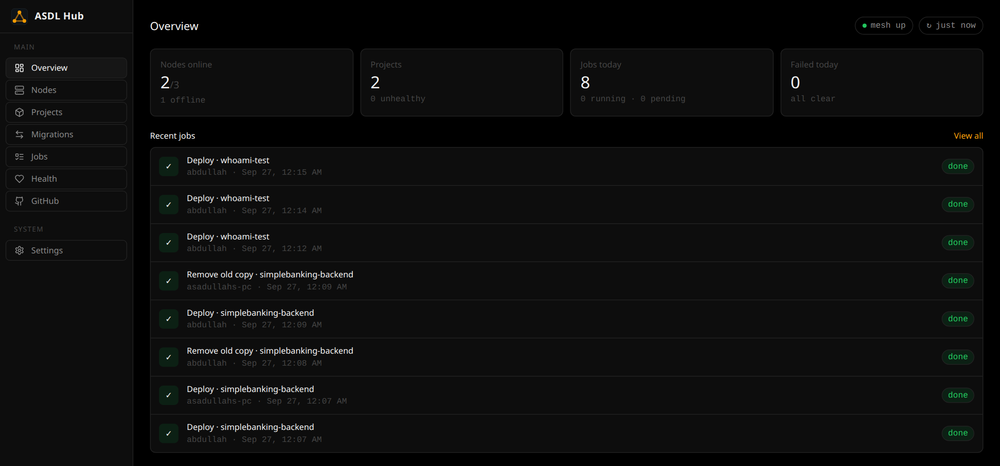

<div align="center">


# ASDL Hub

**Run your apps across your own machines — with deploys, secrets, HTTPS and failover handled for you.**

[](https://github.com/asadullahbro/ASDL-Hub/releases/latest)
[](https://github.com/asadullahbro/ASDL-Hub/actions)
[](LICENSE)
[](https://docs.asdl.website/hub/overview/)

[Documentation](https://docs.asdl.website/hub/overview/) ·
[Install](#install) ·
[Deploy from GitHub](https://docs.asdl.website/hub/deploy-from-github/) ·
[Releases](https://github.com/asadullahbro/ASDL-Hub/releases)

</div>

<br>

<p align="center">
  
</p>

ASDL Hub turns the machines you already have — a VPS, a desktop, a laptop —
into one place to run your apps. Push to GitHub and your app is deployed to a
healthy machine, served on your domain over HTTPS, and moved to another
machine automatically if its own goes down.

## Features

| Feature | What it does |
|---|---|
| **Deploy from GitHub Actions** | Push to your repo and the app updates. The Hub verifies the workflow with GitHub OIDC — no deploy keys to manage, and a repo can only deploy its own image. |
| **Encrypted secrets** | Paste your `.env` into the dashboard. Values are encrypted at rest, masked in the UI and API, and only reach the container when it starts. |
| **Automatic ports** | The Hub reads the port your image exposes and picks a free one on the machine, so apps never clash. |
| **Domains and HTTPS** | Set a domain on an app; the Hub routes it and gets and renews a Let's Encrypt certificate. |
| **Failover in ~30 seconds** | Apps are health-checked every 10 seconds. If a machine or app stops answering, the app is redeployed on the healthiest other machine and traffic follows it. |
| **Private mesh network** | Machines join over WireGuard. Only the Hub is exposed to the internet — a home PC behind a router works as a node. |
| **One dashboard** | Nodes, apps, jobs with full logs, health, and a web terminal to each machine. |

## How it works

```text
                     Internet
                        │  https://your-app.example.com
                        ▼
          ┌───────────────────────────┐
          │          ASDL Hub         │   dashboard + API · PostgreSQL
          │   (your server, public)   │   nginx: domains + certificates
          └─────────────┬─────────────┘
                        │  WireGuard mesh
         ┌──────────────┼──────────────┐
         ▼              ▼              ▼
     ┌────────┐     ┌────────┐     ┌────────┐
     │  Node  │     │  Node  │     │  Node  │   ASDL Agent + Docker
     └────────┘     └────────┘     └────────┘
```

The Hub runs on one server with a public IP. Each machine that runs apps runs
the [ASDL Agent](https://github.com/asadullahbro/asdl-agent), which joins the
private network, reports its health and runs the containers the Hub assigns
it.

## Install

On an Ubuntu or Debian server (amd64 or arm64):

```bash
curl -fsSL https://get.asdl.website/asdl-hub | sudo bash
```

The installer sets up PostgreSQL, WireGuard, nginx, the firewall, HTTPS for
the dashboard and the Hub itself, then prints your dashboard URL and admin
login. A domain is optional — without one the Hub uses the server's IP.

Run the same command to upgrade; your data and settings are kept. To install
a specific version, put it before the project name:

```bash
curl -fsSL https://get.asdl.website/v0.6.1/asdl-hub | sudo bash
```

## Get started

1. **[Add a node](https://docs.asdl.website/hub/add-a-node/)** — run one command on each machine.
2. **[Deploy from GitHub](https://docs.asdl.website/hub/deploy-from-github/)** — add a workflow to your repo.
3. **[Give it a domain](https://docs.asdl.website/hub/domains-and-https/)** — point DNS at the Hub and set the domain on the app.

Everything else is in the **[documentation](https://docs.asdl.website/hub/overview/)**.

## Building from source

Requires Go 1.25+ and Node.js 22+.

```bash
git clone https://github.com/asadullahbro/ASDL-Hub.git
cd ASDL-Hub
(cd dashboard && npm ci && npm run build)
go test ./...
go build -o bin/asdl-hub ./cmd/hub
```

## Status

ASDL Hub is under active development and approaching its first stable
release; expect occasional breaking changes until then. Releases and their
changes are listed on the [releases page](https://github.com/asadullahbro/ASDL-Hub/releases).

## License

[Apache License 2.0](LICENSE)
